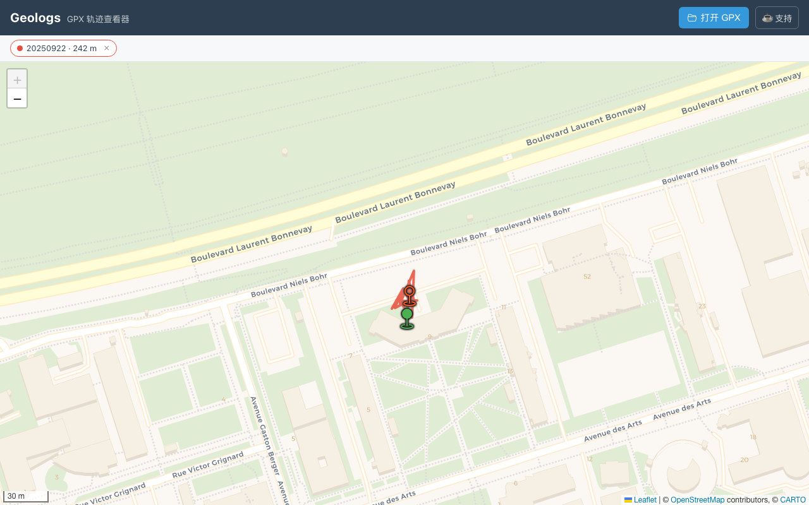

# Geologs

**在线 GPX 轨迹查看器 / Online GPX track viewer** — <https://geologs.snownamida.top>

在地图上浏览 GPS 轨迹：距离、时长、起终点一目了然。也可以把本地 `.gpx` 文件直接拖进页面查看 —
文件**完全在浏览器内解析，不会上传到任何服务器**。

Drop a local `.gpx` file onto the map to view it — parsed entirely in your browser, nothing is uploaded.



## 功能

- 🗺️ 地图轨迹渲染（Leaflet + CARTO Voyager 底图），自动缩放到轨迹范围
- 📂 拖放或选择本地 GPX 文件，支持多文件、多轨迹同时显示（本地解析，零上传）
- 📏 每条轨迹的距离、时长、日期、起终点标注与悬停提示
- ⚡ 大轨迹自动 Douglas–Peucker 抽稀，渲染流畅（统计仍基于全量点）
- 📱 移动端适配
- ☁️ 作者的最新轨迹由 Cloudflare R2 提供，经 Pages Function 读取

## 技术栈

| 层 | 技术 |
| --- | --- |
| 前端 | React 19 · TypeScript · Vite 6 |
| 地图 | Leaflet · react-leaflet · @tmcw/togeojson |
| 部署 | Cloudflare Pages（`main` 分支 = 生产环境） |
| 存储 | Cloudflare R2（bucket `geologs`，经 `/files/*` Pages Function 读取） |
| 上传 | `gpx-files-uploader/` 中的 PowerShell 脚本 + Windows 计划任务 |

## 本地开发

```bash
cd frontend
corepack yarn install   # 项目使用 Yarn 3（见 packageManager 字段）
corepack yarn dev       # Vite 开发服务器
corepack yarn build     # 类型检查 + 生产构建 → dist/
corepack yarn preview   # 构建后用 wrangler pages dev 本地预览（含 R2 绑定）
corepack yarn lint      # ESLint
```

> 开发模式下 `/files/gpx/1.gpx` 不可用（它由 Cloudflare Pages Function + R2 提供）。
> 页面会提示默认轨迹加载失败，此时直接拖入本地 GPX 文件即可调试。
> 若需要完整链路，用 `corepack yarn preview`（需要 `wrangler login` 与 R2 权限）。

## 数据格式与流程

1. 手机端用 [GPSLogger](https://gpslogger.app/) 记录轨迹，输出标准 **GPX 1.1**（`<trk>/<trkseg>/<trkpt>`，含 `<time>` 时间戳）。
2. `gpx-files-uploader/upload.ps1` 定时把目录中最新的 `.gpx` 上传到 R2：`geologs/gpx/1.gpx`。
3. 前端启动时通过 `/files/gpx/1.gpx`（Pages Function → R2）拉取并渲染。
4. 访客拖入的 GPX 只在浏览器内存中解析，刷新即消失，不产生任何网络上传。

## 支持

如果这个项目对你有帮助，可以 [☕ 请我喝杯咖啡](https://ko-fi.com/snownamida)。

## 许可

[MIT](LICENSE) © Snownamida
